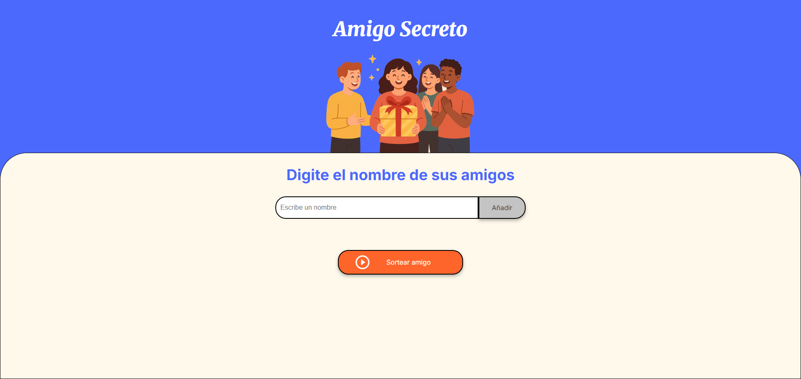

````
# 🎁 Amigo Secreto


¡Organiza tu **Amigo Secreto** de manera fácil y divertida!  
Agrega nombres de tus amigos y sortea automáticamente quién le toca a quién. Perfecta para **reuniones familiares, amigos o compañeros de trabajo**.

---

## 🌟 Características

- ✏️ **Agregar nombres** de participantes de forma rápida.  
- 📋 **Visualizar la lista** de amigos agregados.  
- 🎲 **Sortear al azar** quién es el amigo secreto de cada participante.  
- 📱 Interfaz **responsive** para móviles, tablets y desktop.  
- 🎨 Diseño colorido con imagen representativa de Amigo Secreto.

---

## 🛠 Tecnologías

- HTML5  
- CSS3  
- JavaScript (vanilla)  
- Google Fonts: Merriweather y Inter  

---

## 🚀 Demo en vivo

Prueba la app directamente en tu navegador:  
[🌐 Demo Amigo Secreto](https://kavaci10.github.io/app-amigo-secreto/)

---

## 💾 Instalación

1. Clona el repositorio:  
   ```bash
   git clone https://github.com/kavaci10/app-amigo-secreto.git
````

2. Abre el archivo `index.html` en tu navegador.
3. ¡Listo! Ahora puedes empezar a agregar nombres y sortear.

---

## 🎮 Uso

1. 📝 Escribe el nombre de un amigo en el campo de entrada.
2. ➕ Haz clic en **Añadir** para agregarlo a la lista.
3. 🎲 Cuando tengas todos los amigos agregados, haz clic en **Sortear amigo**.
4. ✅ El resultado se mostrará en la sección inferior.

---

## 📂 Estructura de Archivos

```
app-amigo-secreto/
│
├─ index.html        ← Archivo principal HTML
├─ style.css         ← Estilos de la app
├─ app.js            ← Lógica de JavaScript
└─ assets/           ← Imágenes y recursos (logo, iconos)
```

---

## 🖼 Capturas

 

---

## 🤝 Contribuciones

¡Contribuciones son bienvenidas!
Puedes abrir un **issue** o enviar un **pull request** con mejoras.

---

## ⚖️ Licencia

Este proyecto está bajo la licencia **MIT**.


---


